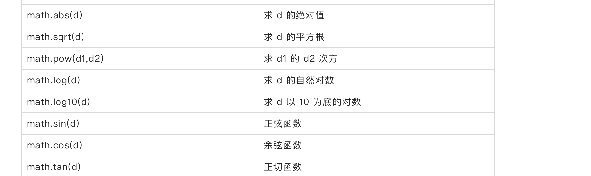

# 9. exports 和模块

函数是组织代码的一种有效形式，模块是比函数更大粒度的一个方式，模块将一系列相关的函数组织在一起，例如内置的 `math` 模块，就包含了一系列数学函数调用，





除了内置模块之外，你也可以将你的代码组织成模块的形式。


**注意：模块系统需要启用**[** **** 语法**](https://www.yuque.com/boyan-avfmj/aviatorscript/yr1oau#6Upjs)`**Feature.Module**`**。**


## exports


比如我们定义了一个快排的模块：


```javascript
## examples/qsort.av
## Author: dennis
## Desc: a script to define a quick-sort function qsort.

fn swap(xs, l, r) {
  let temp = xs[l];
  xs[l] = xs[r];
  xs[r] = temp; 
}

fn partition(xs, l, r, p)  {
  while l <= r {
    while xs[l] < p  {
      l = l+1;
    }
    while xs[r] > p {
      r = r -1;
    } 
    if l <= r {
      swap(xs, l, r);
       l = l+1;
       r = r -1;
    }
  }
  return l;
}

fn qsort0(xs, l, r) {
  if l >= r {
    return;
  }
  
  let p = xs[(l+r)/2];
  let i = partition(xs, l, r, p);
  qsort0(xs, l, i-1);
  qsort0(xs, i, r);
}

qsort = lambda(xs) ->
  qsort0(xs, 0, count(xs)-1);
  return xs;
end;

## export qsort
exports.sort = qsort;

```


这是一个经典的快速排序实现， `swap` 函数用于交换集合两个位置的元素， `partition` 用于划分集合， `qsort0` 分别对集合的左右两部分做递归排序，最终的 `qsort` 函数接受一个集合 `xs` ，然后调用 `qsort0` 进行实际的排序工作。


这里特别要注意的是 `exports.sort = qsort` 这一行，这样就将 qsort 函数设置为公开并命名为 `sort` ，模块外的代码可以访问 `sort`  方法，它将调用 `qsort` 函数。**没有通过 **`**exports**`** 导出的函数，将无法被模块外的代码访问。**

****

## require 和 load
定义并导出了 `qsort` 模块后，我们可以在模块之外这么使用：


```javascript
## examples/test_qsort.av

let q = require('examples/qsort.av');

fn rand_list(n) {
  let a = seq.list();
  for i in range(0, n) {
    seq.add(a, rand(n));
  }
  return a;
}

let a = rand_list(20);
println("before sorting: " + a);
q.sort(a);
println("after sorting: " + a);
```


我们通过 `let q = require('examples/qsort.av');` 引用了模块 `qsort` ，接下来调用 `q.sort(a)` 排序随机数组 a。


使用 `RunScriptExample` 来跑上述例子，输出：


```plain
before sorting: [8, 12, 5, 13, 19, 3, 3, 6, 19, 18, 16, 18, 8, 13, 18, 6, 18, 2, 9, 13]
after sorting: [2, 3, 3, 5, 6, 6, 8, 8, 9, 12, 13, 13, 13, 16, 18, 18, 18, 18, 19, 19]
```


`require(path)` 用于加载 `path` 路径指定的模块，查找的顺序跟 `AviatorEvaluatorInstance#compileScript` 一样：

1. 先假设 path 是绝对路径，尝试加载
2. 尝试从当前线程的类加载器 `ClassLoader` 使用 `getResourceAsStream(path)` 加载，如果未找到，则使用给 path 加上 `/` 前缀再次使用 `getResourceAsStream` 尝试查找。
3. 最后，尝试从当前 `AviatorEvaluatorInstance` 类加载器，按照第二条规则类似的方式再次查找。
4. 如果都没有找到，将抛出运行时异常。


`require` 函数如果加载成功，将返回模块的 `exports` ，这样就可以调用模块的导出函数了。


除了 `require` 函数之外，你也可以用 `load(path)`函数，不同的是 `load` 每次都将重新编译并执行模块代码，而 `require` 是按照 `path` 做了模块缓存。假设我们修改 `qsort` 模块，加入一行打印：


```javascript
## examples/qsort.av
## Author: dennis
## Desc: a script to define a quick-sort function qsort.

fn swap(xs, l, r) {
  let temp = xs[l];
  xs[l] = xs[r];
  xs[r] = temp; 
}

fn partition(xs, l, r, p)  {
  while l <= r {
    while xs[l] < p  {
      l = l+1;
    }
    while xs[r] > p {
      r = r -1;
    } 
    if l <= r {
      swap(xs, l, r);
       l = l+1;
       r = r -1;
    }
  }
  return l;
}

fn qsort0(xs, l, r) {
  if l >= r {
    return;
  }
  
  let p = xs[(l+r)/2];
  let i = partition(xs, l, r, p);
  qsort0(xs, l, i-1);
  qsort0(xs, i, r);
}

qsort = lambda(xs) ->
  qsort0(xs, 0, count(xs)-1);
  return xs;
end;

## export qsort
exports.sort = qsort;
## println something
println("load qsort module.");
```


我们继续用 `require` 来调用，只是重复两次：


```javascript
## examples/test_qsort.av

let q = require('examples/qsort.av');
let q = require('examples/qsort.av');

fn rand_list(n) {
  let a = seq.list();
  for i in range(0, n) {
    seq.add(a, rand(n));
  }
  return a;
}

let a = rand_list(20);
println("before sorting: " + a);
q.sort(a);
println("after sorting: " + a);
```


这样将打印：


```plain
load qsort module.
before sorting: [4, 19, 2, 15, 4, 9, 3, 1, 19, 7, 11, 2, 8, 4, 17, 1, 7, 14, 11, 14]
after sorting: [1, 1, 2, 2, 3, 4, 4, 4, 7, 7, 8, 9, 11, 11, 14, 14, 15, 17, 19, 19]
```


尽管我们调用了 `require` 两次，也只打印了一次 `load qsort module.` ，这就是 require 带了 module cache 的缘故。


如果我们将 `require` 替换为 `load` ：

```javascript
## examples/load_qsort.av

let q = load('examples/qsort.av');
let q = load('examples/qsort.av');

fn rand_list(n) {
  let a = seq.list();
  for i in range(0, n) {
    seq.add(a, rand(n));
  }
  return a;
}

let a = rand_list(20);
println("before sorting: " + a);
q.sort(a);
println("after sorting: " + a);
```


这次将打印两次了：


```plain
load qsort module.
load qsort module.
before sorting: [12, 19, 11, 0, 17, 13, 1, 3, 3, 0, 5, 18, 3, 13, 18, 15, 9, 6, 13, 3]
after sorting: [0, 0, 1, 3, 3, 3, 3, 5, 6, 9, 11, 12, 13, 13, 13, 15, 17, 18, 18, 19]
```


**通常来说你都应该使用 **`**require**`** 来减少模块不必要的重新编译和加载。**

****

## __MODULE__


在被加载模块中，可以通过 `__MODULE__` 获取当前模块的信息，包括：


+ `path` ，当前模块的代码路径
+ `exports` ，当前模块导出的函数或者变量列表。


只有被 load 或者 require 的模块才有这 `exports` 和 `__MODULE__` 这两个特殊变量，其中 `__MODULE__.exports` 指向了 `exports` 。


因此可以直接赋值给 `__MODULE__.exports` 来整体导出一个方法列表：


```javascript
## examples/module.av

## a test module

let m = seq.map();

m.add = lambda(x, y) ->
  x + y
end;
m.sub = lambda(x, y) ->
  x - y
end;

println("module path: " + __MODULE__.path);

__MODULE__.exports = m;
```


我们创建了一个 map 实例 `m` ，并给 m 设置了两个变量 `m.add`  和 `m.sub` 分别赋值了两个函数。最后将整个 m 赋值给了 `__MODULE__.exports` ，这样这个测试模块导出了两个方法 `add` 和 `sub` ，我们可以这样使用它们：


```javascript
## examples/test_module.av

let t = require('examples/module.av');

println(t.add(1, 2));
println(t.sub(1, 2));
```


这样将打印：


```plain
module path: examples/module.av
3
-1
```


其中第一行是在 `module.av` 里打印的，而 3 和 -1 是分别执行 `t.add(1, 2)` 和 `t.sub(1, 2)` 的结果。


> 更新: 2022-09-19 19:02:19  
> 原文: <https://www.yuque.com/boyan-avfmj/aviatorscript/rqra81>