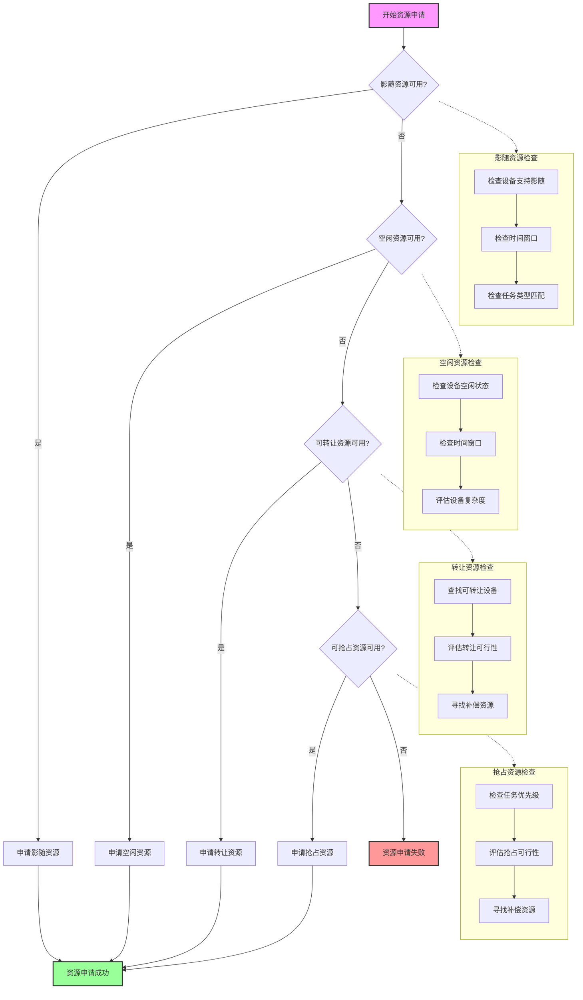

# 一体化资源申请流程

## 申请方式说明

### 1. 影随资源申请
- 检查设备是否支持影随模式
- 检查时间窗口是否可用
- 检查任务类型是否匹配

### 2. 空闲资源申请
- 检查设备当前是否空闲
- 检查时间窗口是否可用
- 评估设备复杂度，优先选择简单设备

### 3. 转让资源申请
- 查找可转让的设备
- 评估转让的可行性
- 为原任务寻找补偿资源

### 4. 抢占资源申请
- 检查任务优先级
- 评估抢占的可行性
- 为被抢占任务寻找补偿资源

## 优先级顺序
1. 影随资源
2. 空闲资源
3. 可转让资源
4. 可抢占资源

## 异常处理
- 每种申请方式失败后自动尝试下一种方式
- 记录详细的失败原因
- 支持事务回滚，确保数据一致性
- 提供完整的申请过程日志
